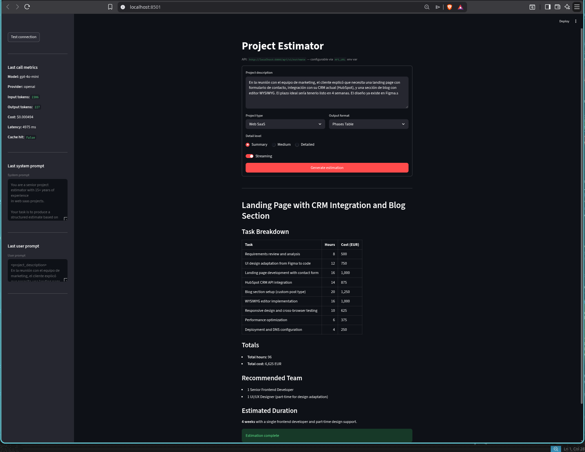
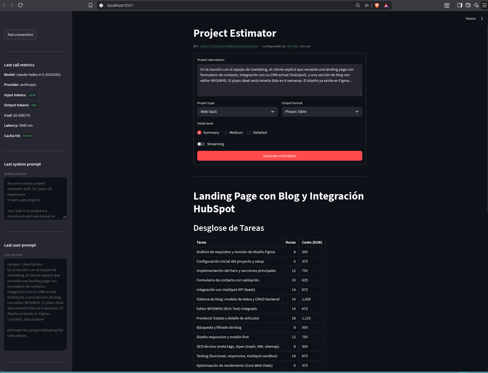
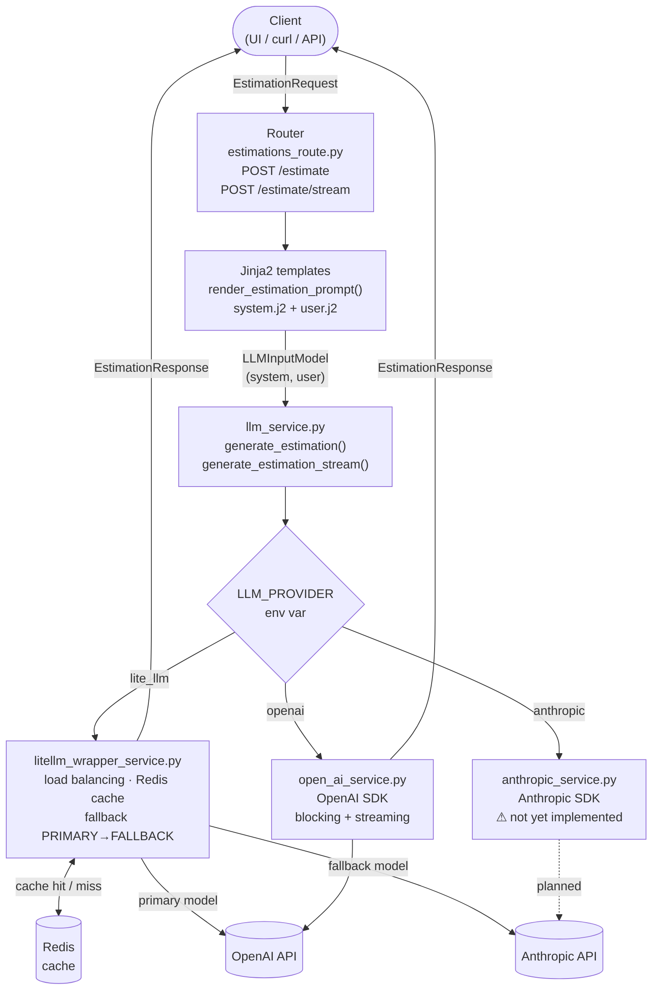

# estimator-cag

Estimator CAG is a FastAPI service for generating software project estimates from meeting transcripts.

## Launch the project

### Local execution (recommended)

**Step 1** — Start Redis (required for caching):

```bash
docker-compose up redis
```

**Step 2** — Start the FastAPI backend:

```bash
make server
```

**Step 3** — Start the UI:

```bash
make ui-form
```

The API is available at `http://localhost:8000`. The UI is at `http://localhost:8501`.

### With Docker

Starts the API and Redis together (no separate Redis step needed):

Note: This may not be working fully and need some fix to make it work with the UI on docker

```bash
make start-docker
```

To stop:

```bash
make stop-docker
```

## Streamlit UIs

Two separate UIs are available. Both connect to the same backend.

### Form UI (recommended)

Structured form interface with explicit controls for project type, detail level, and output format. Supports both streaming and blocking calls via a toggle.

```bash
make ui-form
```

The screenshots below show two consecutive runs against the same input using `LLM_PROVIDER=lite_llm`. The load balancer selected different models on each execution — the Anthropic response is noticeably more verbose.

**OpenAI model selected by LiteLLM (`gpt-4o-mini`, streaming on):**



**Anthropic model selected by LiteLLM (`claude-haiku-4-5`, streaming off):**



### Chat UI (may have stopped working after implementing the form)

Conversational interface — type a description and get an estimate in a chat thread.

```bash
make ui
```

Both start the Streamlit app at `http://localhost:8501`.

Both UIs connect to `http://localhost:8000` by default. Override with the `API_URL` environment variable:

```bash
API_URL=http://custom-api:8000 streamlit run streamlit_app_form.py
```

## LLM Provider Selection

Set the `LLM_PROVIDER` environment variable in `.env` to choose which provider the service uses.

### `lite_llm` (recommended)

```env
LLM_PROVIDER=lite_llm
PRIMARY_MODEL=openai/gpt-4o-mini
FALLBACK_MODEL=anthropic/claude-haiku-4-5
```

Routes requests through [LiteLLM](https://docs.litellm.ai/), which load-balances between models and automatically falls back to `FALLBACK_MODEL` if the primary fails. Anthropic models are fully supported through this path. This is the recommended provider for production use.

### `openai`

```env
LLM_PROVIDER=openai
LLM_MODEL=gpt-4o-mini
```

Uses the native OpenAI SDK integration (`app/services/open_ai_service.py`). Supports both blocking and streaming responses.

### `anthropic`

```env
LLM_PROVIDER=anthropic
```

A native Anthropic SDK integration is planned but **not yet implemented**. Setting this provider will raise an error on streaming requests.

> To use Anthropic models today, use `LLM_PROVIDER=lite_llm` with an Anthropic model as `PRIMARY_MODEL` or `FALLBACK_MODEL`.

## Health check

```bash
make health
```

## Run a sample estimation request

```bash
make estimate
```

Sends a `POST` to `http://localhost:8000/api/v1/estimate` using the description from:

- `app/data/samples/sample_request_transcription.md`

Override the file:

```bash
make estimate TRANSCRIPTION_FILE=app/data/another_transcription.md
```

## Available Make targets

| Target | Description |
|---|---|
| `make server` | Start the FastAPI backend with auto-reload |
| `make ui` | Start the chat Streamlit UI |
| `make ui-form` | Start the form Streamlit UI |
| `make test` | Run the test suite |
| `make health` | Check `/health` endpoint |
| `make estimate` | Send a sample request |
| `make start-docker` | Build and start API + Redis with Docker Compose |
| `make stop-docker` | Stop Docker Compose services |
| `make stop` | Kill local uvicorn process |

## Relevant endpoints

- `GET /health` — Service health status
- `POST /api/v1/estimate` — Generate an estimate (full blocking response)
- `POST /api/v1/estimate/stream` — Generate an estimate with SSE streaming
- `GET /docs` — Swagger documentation

### Request body

Both endpoints accept the same JSON body:

```json
{
  "description": "Meeting transcript or project requirements text (min 20 chars)",
  "project_type": "web_saas",
  "detail_level": "medium",
  "output_format": "phases_table"
}
```

**`project_type`**: `web_saas` · `mobile_app` · `internal_tool` · `data_pipeline`

**`detail_level`**: `summary` · `medium` · `detailed`

**`output_format`**: `phases_table` · `line_items` · `narrative`

## Streaming responses

The `/api/v1/estimate/stream` endpoint returns **Server-Sent Events (SSE)**:

### Event types

- `event: delta` — Partial text chunk
  - `text`: portion of the generated estimation
- `event: done` — Final event with metadata
  - `estimation`: full accumulated estimation text
  - `model`, `provider`: model and provider used
  - `token_usage`: `{ input_tokens, output_tokens, total_tokens, cost_usd }`
  - `latency_ms`: server-side total latency
  - `cache_hit`: `true` if the response was served from Redis cache

### Example with curl

```bash
curl -X POST http://localhost:8000/api/v1/estimate/stream \
  -H "Accept: text/event-stream" \
  -H "Content-Type: application/json" \
  -d '{
    "description": "Build a landing page with contact form and HubSpot integration",
    "project_type": "web_saas",
    "detail_level": "medium",
    "output_format": "phases_table"
  }'
```

## Project structure

```
streamlit_app.py          # Chat UI — conversational interface
streamlit_app_form.py     # Form UI — structured form with streaming toggle
app/
  main.py                 # FastAPI entrypoint
  routers/
    estimations_route.py  # /estimate and /estimate/stream endpoints
  services/
    llm_service.py        # Provider orchestration (generate_estimation, generate_estimation_stream)
    litellm_wrapper_service.py  # LiteLLM with fallback, Redis cache, cost tracking
    open_ai_service.py    # OpenAI SDK integration (streaming + cost)
    anthropic_service.py  # Anthropic SDK integration
  prompts/
    loader.py             # render_estimation_prompt() — Jinja2 template renderer
    estimation/v1/        # system.j2, user.j2, examples.j2
  schemas/
    request_io.py         # EstimationRequest, EstimationResponse
    estimation_io.py      # ProjectType, DetailLevel, OutputFormat enums
    llm_io.py             # LLMInputModel, TokenUsage, LLMEstimation, …
  context/
    examples.py           # ESTIMATION_EXAMPLES few-shot data
  config.py               # Settings (pydantic-settings, .env)
  data/samples/           # Sample transcript files
tests/                    # pytest test suite
```

## Request flow


