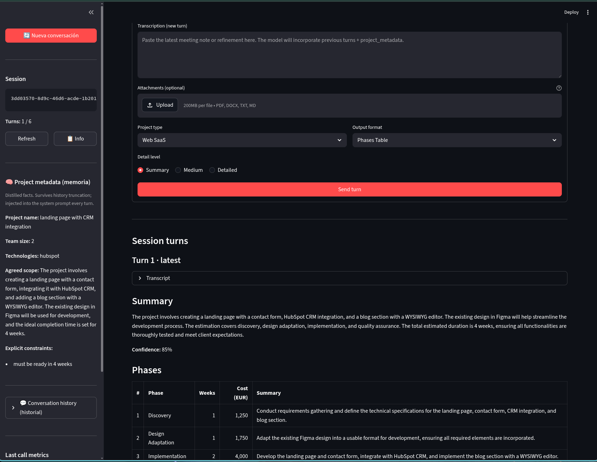
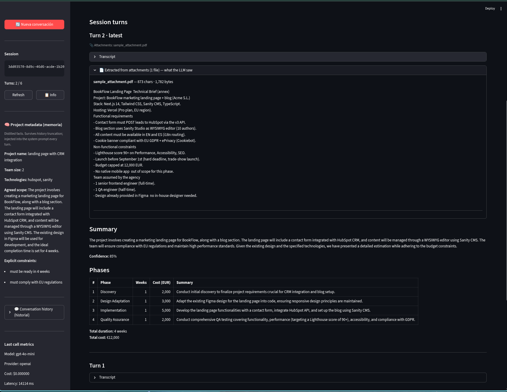
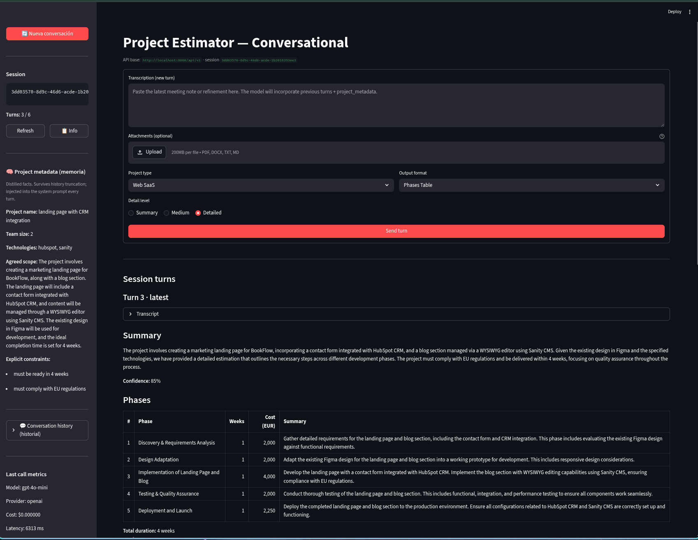
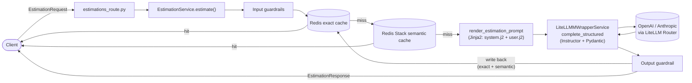
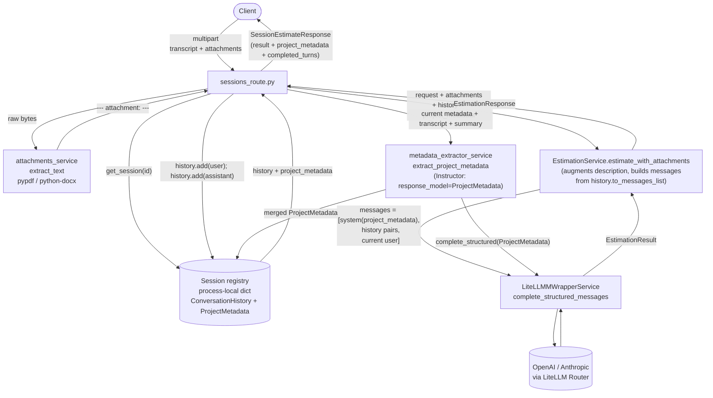

# estimator-cag

**Author:** Ferran (F.F.V)

Estimator CAG is a FastAPI service for generating software project estimates from meeting transcripts.


- Missing to move the `estimator` to its own folder and create a separate folder/project for backend interaction. Will do later on

## Screenshots session handling

- Round1:
 

- Round2:
 

- Round3:
 


## Launch the project

### Local execution (recommended)

**Step 1** — Start Redis (required for caching):

```bash
docker-compose up redis
```

**Step 2** — Start the FastAPI backend:

```bash
make server
```

**Step 3** — Start the UI:

```bash
make ui
```

The API is available at `http://localhost:8000`. The UI is at `http://localhost:8501`.

### With Docker

Starts the API and Redis together (no separate Redis step needed):

Note: This may not be working fully and need some fix to make it work with the UI on docker

```bash
make start-docker
```

To stop:

```bash
make stop-docker
```

## Streamlit UI

```bash
make ui
```

Starts the conversational UI at `http://localhost:8501` against [`streamlit_app.py`](streamlit_app.py). It drives the modern sessions endpoints (`POST /sessions`, `POST /sessions/{id}/estimate`, `GET /sessions/{id}`), supports PDF/DOCX/TXT/MD attachments, shows the live `project_metadata` (memoria) and the windowed `history` (historial) side by side in the sidebar, and exposes a "Nueva conversación" button to reset the state.

Override the backend with the `API_URL` env var (default `http://localhost:8000/api/v1`):

```bash
API_URL=http://custom-api:8000/api/v1 streamlit run streamlit_app.py
```

## LLM Provider Selection

Every estimation goes through [LiteLLM](https://docs.litellm.ai/) wrapped by `LiteLLMMWrapperService`. The wrapper handles  automatic fallback from `PRIMARY_MODEL` to `FALLBACK_MODEL`.

```env
LLM_PROVIDER=openai
PRIMARY_MODEL=openai/gpt-4o-mini
FALLBACK_MODEL=anthropic/claude-haiku-4-5
```

Mixing providers across `PRIMARY_MODEL` / `FALLBACK_MODEL` is supported (OpenAI ↔ Anthropic) — LiteLLM normalises responses and the wrapper turns the result into an Instructor-validated Pydantic model.

> **Legacy paths** — the repository still contains `app/services/llm_service.py`, `app/services/open_ai_service.py`, and `app/services/anthropic_service.py`, plus the SSE endpoint `POST /api/v1/estimate/stream` that calls into them. These are kept for backwards compatibility with the Step-3 streaming UI and are **not** part of the supported flow documented below. New work should target `EstimationService` + `LiteLLMMWrapperService` only. Do no include in CLAUDE.md

## Conversational sessions and attachments

The service exposes a session-scoped, multipart endpoint for multi-turn use:

```
POST /api/v1/sessions                          → { "session_id": "<uuid4>" }
POST /api/v1/sessions/{session_id}/estimate    (multipart/form-data)
    transcript:      str          (required, 20–80 000 chars)
    project_type:    str          (web_saas | mobile_app | internal_tool | data_pipeline)
    detail_level:    str          (summary | medium | detailed)
    output_format:   str          (phases_table | line_items | narrative)
    attachments:     file[]       (optional; .pdf, .docx, .txt, .md)
```

### Attachments — Path B: local extraction (chosen)

PDFs are parsed with [`pypdf`](https://pypdf.readthedocs.io/) and Word documents with [`python-docx`](https://python-docx.readthedocs.io/). Extracted text is concatenated to the transcript with a clear `--- attachment: <filename> ---` separator before the prompt is rendered. The rest of the pipeline (input guardrails → exact cache → semantic cache → Instructor structured output → output guardrail → cache writes) runs unchanged.

**Why Path B over Path A (provider Files API):**

- **Provider-independent.** The extracted text flows through the same `EstimationService` + `LiteLLMMWrapperService` path used for plain transcripts, so the OpenAI ↔ Anthropic fallback configured in LiteLLM keeps working. Path A's OpenAI `file_id` references would not survive a fallback to Anthropic.
- **RAG-ready.** Once the text is in our hands we can chunk, embed, and store it — which is the foundation for Module 3 (retrieval-augmented context). Path A would have kept the document opaque inside the provider.
- **Deterministic.** The same file always yields the same text, so the exact-match cache hit rate stays high. Path A relies on the provider's parser, which can change silently.

Trade-offs we accept:

- Extraction is best-effort: scanned PDFs without an OCR layer come back as empty strings. We log a warning; the LLM call still runs but obviously can't reason about the missing content.
- Large attachments can push the augmented description past the 80 000-character `description` limit. Today this fails the Pydantic validator on the augmented request; a future iteration should truncate or summarize before submission.
- Word docs with embedded images and tables are extracted as flat paragraph text — formatting is lost. Acceptable for estimation transcripts.

Implementation: [`app/services/attachments_service.py`](app/services/attachments_service.py) (extractors) and [`app/services/estimation_service.py`](app/services/estimation_service.py) (`estimate_with_attachments`).

#### How the extracted text reaches the LLM

**Short version**: the extracted text is concatenated into the request's `description` field. It then flows through the **user prompt** — not the system prompt. The system prompt only carries `project_metadata` (see the next section).

Step-by-step trace:

**1) Route reads the multipart upload** — [`app/routers/sessions_route.py`](app/routers/sessions_route.py)

```python
raw_attachments: list[tuple[str, bytes]] = []
if attachments:
    for upload in attachments:
        content = await upload.read()
        raw_attachments.append((upload.filename or "attachment", content))
```

Each `UploadFile` becomes a `(filename, bytes)` pair. No prompt rendering yet.

**2) Service extracts + concatenates** — [`app/services/estimation_service.py`](app/services/estimation_service.py) (`estimate_with_attachments`)

```python
parts: list[str] = [request.description]            # starts with the transcript
for filename, content in attachments:
    text = extract_text(filename, content)          # pypdf / python-docx
    parts.append(
        ATTACHMENT_SEPARATOR_TEMPLATE.format(       # "\n\n--- attachment: X ---\n<text>"
            filename=filename, text=text,
        )
    )

augmented_request = request.model_copy(
    update={"description": "\n".join(parts)}        # description is replaced wholesale
)
return self.estimate(augmented_request, ...)        # rest of pipeline sees only this
```

After this, `request.description` literally looks like:

```
<original transcript>


--- attachment: sample_attachment.pdf ---
BookFlow Landing Page Technical Brief (annex)
Project: BookFlow marketing landing page + blog (Acme S.L.)
Stack: Next.js 14, Tailwind CSS, Sanity CMS, TypeScript.
...
```

To the rest of the pipeline (guardrails, caches, prompt rendering) it is indistinguishable from a very long transcript.

**3) Jinja renders the user prompt** — [`app/prompts/estimation/v1/user.j2`](app/prompts/estimation/v1/user.j2)

```jinja2
<project_description>
{{ description }}
</project_description>

Project type: {{ project_type }}.
Estimate this project following the rules above.
```

`{{ description }}` is the augmented string from step 2. So the user message the LLM receives is:

```
<project_description>
<original transcript>


--- attachment: sample_attachment.pdf ---
BookFlow Landing Page Technical Brief (annex)
...
</project_description>

Project type: web_saas.
Estimate this project following the rules above.
```

**4) Messages array shipped to LiteLLM**

- **Single-turn** (`/api/v1/estimate`): `[ {"role": "system", "content": <system.j2>}, {"role": "user", "content": <user.j2 above>} ]` — built by `LiteLLMMWrapperService.complete_structured`.
- **Multi-turn** (`/api/v1/sessions/{id}/estimate`): `[ system, …prior history pairs…, {"role": "user", "content": <user.j2 with attachments>} ]` — built via `history.to_messages_list(system_prompt) + [{"role": "user", "content": user_message}]` and sent through `complete_structured_messages`.

In both cases the attachment text rides inside the **user** message only.

#### Where it is *not*

The system prompt ([`app/prompts/estimation/v1/system.j2`](app/prompts/estimation/v1/system.j2)) carries:

- The role definition + rate sheet + scope rules.
- The `<project_metadata>` block (memoria — extracted facts from prior turns).
- The `<output_format>` and `<detail_level>` switches.
- The few-shot examples.

It never sees `{{ description }}` or any attachment text. The separation is deliberate:

- **System prompt** = stable instructions + slowly-evolving facts about the project (`ProjectMetadata`).
- **User prompt** = the volatile turn-specific input (transcript + attachments).

This also explains why the exact cache key in `EstimationService._exact_cache_key` hashes `request.description` — which by that point already includes the extracted text — so identical transcript + identical attachments + identical metadata yields the same cache entry.

#### Quick way to see the augmented string

The server logs the per-file extraction with a 160-char preview:

```
estimation_attachments_processed count=1 attachments=[
    {'filename': 'sample_attachment.pdf', 'bytes': 1782, 'chars': 874,
     'preview': 'BookFlow Landing Page  Technical Brief (annex)\n…'}
]
```

And the UI's `📄 Extracted from attachments — what the LLM saw` expander on each turn shows the full text that was spliced into `description` before `user.j2` rendered it.

### Project metadata (Step 4 — LLM extractor)

After every turn of `POST /sessions/{session_id}/estimate`, the server runs a small extractor call against the LLM to refresh the session's `ProjectMetadata` (project name, assumed team size, mentioned technologies, agreed scope). The refreshed metadata is injected into the **next** turn's system prompt under a `<project_metadata>` block so the model can build on what previous turns established.

**Why LLM extractor instead of regex heuristics:**

- **Language and style coverage.** Transcripts arrive in Spanish and English and mix capitalisation, abbreviations, and informal phrasing. A heuristic that catches one style misses the others; the model normalises across both for free.
- **Reuse, not new infrastructure.** The codebase already runs every estimation through [Instructor](https://python.useinstructor.com/) with `response_model=` for structured output. Pointing the same wrapper at `response_model=ProjectMetadata` keeps the surface area small and the failure modes consistent (Pydantic validators, automatic re-prompts).
- **Marginal cost.** The extractor prompt is small (current metadata JSON + last user transcript + last assistant summary) and runs against the cheap primary model (`gpt-4o-mini` by default). On a typical turn it adds a few hundred prompt tokens — negligible next to the estimation call itself.

What we lose in return: one extra LLM call per turn (~200–500 ms latency, fractions of a cent) and a non-zero rate of "no useful update" turns. We accept this because extractor failures are isolated — [`extract_project_metadata`](app/services/metadata_extractor_service.py) returns the previous metadata unchanged on any error, so the user-facing estimation never breaks because metadata extraction did.

A defensive merge in code (union of `mentioned_technologies`, lowercase canonical form) guarantees the cumulative list cannot shrink between turns even if the LLM omits earlier entries.

Implementation: [`app/services/metadata_extractor_service.py`](app/services/metadata_extractor_service.py), [`app/prompts/estimation/v1/system.j2`](app/prompts/estimation/v1/system.j2) (`<project_metadata>` block), and [`app/prompts/loader.py`](app/prompts/loader.py) (template wiring).

## Health check

```bash
make health
```

## Run a sample estimation request

```bash
make estimate
```

Sends a `POST` to `http://localhost:8000/api/v1/estimate` using the description from:

- `app/data/samples/sample_request_transcription.md`

Override the file:

```bash
make estimate TRANSCRIPTION_FILE=app/data/another_transcription.md
```

## Available Make targets

| Target | Description |
|---|---|
| `make server` | Start the FastAPI backend with auto-reload |
| `make ui` | Start the conversational Streamlit UI |
| `make test` | Run the test suite |
| `make health` | Check `/health` endpoint |
| `make estimate` | Send a sample request |
| `make start-docker` | Build and start API + Redis with Docker Compose |
| `make stop-docker` | Stop Docker Compose services |
| `make stop` | Kill local uvicorn process |

## Endpoints

| Method | Path | Purpose |
|---|---|---|
| `GET` | `/health` | Service health |
| `GET` | `/docs` | Swagger UI |
| `POST` | `/api/v1/estimate` | Single-turn estimation (stateless, JSON body) |
| `POST` | `/api/v1/sessions` | Create a session — returns `{ "session_id": "<uuid4>" }` |
| `POST` | `/api/v1/sessions/{session_id}/estimate` | Multi-turn estimation with optional attachments (multipart) |
| `GET` | `/api/v1/sessions/{session_id}` | Inspect a session's history + project_metadata (audit) |

### Stateless request body (`POST /api/v1/estimate`)

```json
{
  "description": "Meeting transcript or project requirements text (min 20 chars)",
  "project_type": "web_saas",
  "detail_level": "medium",
  "output_format": "phases_table"
}
```

### Multi-turn request body (`POST /api/v1/sessions/{session_id}/estimate`, multipart/form-data)

| Field | Type | Notes |
|---|---|---|
| `transcript` | string | Required, 20–80 000 chars |
| `project_type` | string | `web_saas` · `mobile_app` · `internal_tool` · `data_pipeline` |
| `detail_level` | string | `summary` · `medium` · `detailed` |
| `output_format` | string | `phases_table` · `line_items` · `narrative` |
| `attachments` | file[] | Optional; `.pdf`, `.docx`, `.txt`, `.md` |

Response includes the standard `EstimationResponse` alongside the freshly-refreshed `project_metadata` and the current `completed_turns` count, so the client can render the new state without a second round-trip.

## Project structure

```
streamlit_app.py                       # Conversational UI — supported
app/
  main.py                              # FastAPI entrypoint
  config.py                            # Settings (pydantic-settings, .env)
  routers/
    estimations_route.py               # POST /api/v1/estimate (stateless)
    sessions_route.py                  # POST /sessions, POST /sessions/{id}/estimate, GET /sessions/{id}
  services/
    estimation_service.py              # Pipeline orchestrator (the single entry point)
    litellm_wrapper_service.py         # LiteLLM + Instructor + cost/cache/fallback
    sessions.py                        # ConversationHistory, ProjectMetadata, Session + registry
    attachments_service.py             # Path B: pypdf / python-docx text extraction
    metadata_extractor_service.py      # Post-turn ProjectMetadata extractor (Step 4)
    cache_service.py                   # Redis exact-match cache (SHA-256 keyed)
  cache/
    semantic.py                        # Redis Stack / RediSearch semantic cache
  guardrails/
    input.py                           # Moderation + injection + PII heuristics
    output.py                          # enforce_scope_response (low-confidence filter)
  prompts/
    loader.py                          # render_estimation_prompt(..., project_metadata=...)
    estimation/v1/                     # system.j2 (+ <project_metadata> block), user.j2, examples.j2
  schemas/
    estimation.py                      # EstimationRequest/Response, EstimationResult, enums
    llm_io.py                          # TokenUsage, provider info, …
tests/                                 # pytest suite (incl. tests/test_sessions_endpoint.py)
```

## Request flow — stateless single-turn

`POST /api/v1/estimate` runs the full pipeline atomically. Both caches participate; on a hit, no LLM call is made.



## Request flow — multi-turn session

`POST /api/v1/sessions/{session_id}/estimate` adds three things on top of the stateless flow: attachment extraction, history-aware prompting, and post-turn metadata extraction. Caches are skipped on multi-turn calls because every turn carries a unique prior context.



Two invariants worth holding in mind while reading the flow:

- The system prompt is **regenerated from `ProjectMetadata` on every turn** via `render_estimation_prompt(..., project_metadata=...)`. It is never persisted in `ConversationHistory`.
- `ProjectMetadata` survives the sliding-window truncation that `ConversationHistory` performs after each turn. The metadata block in `system.j2` ends with a "treat as established facts" instruction so the LLM keeps respecting facts whose originating turns have rolled out of the window.
