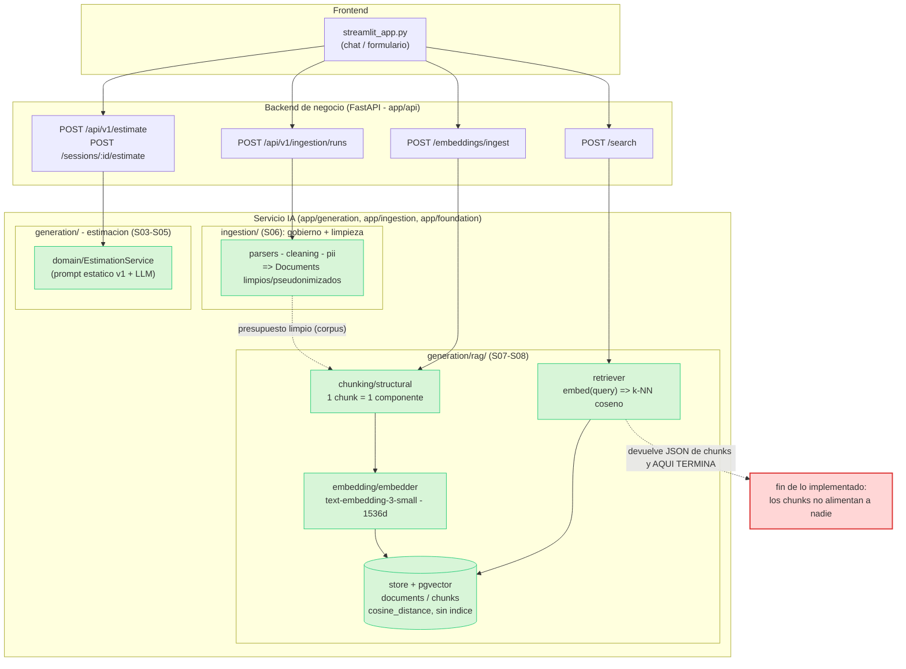
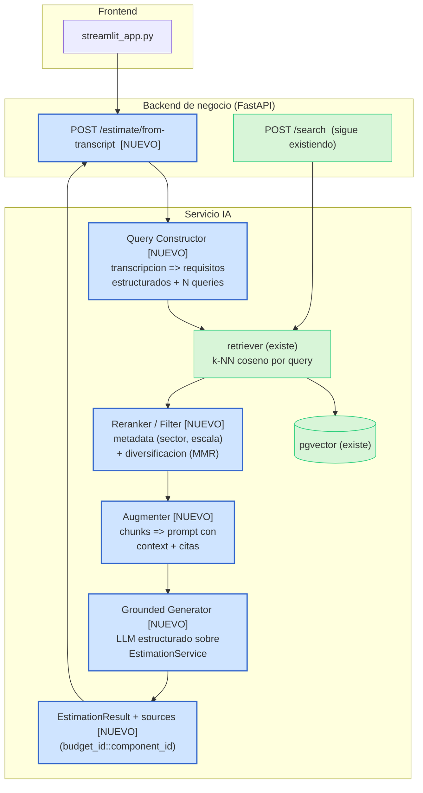

# Diagnóstico arquitectónico — Sesión 09 (pre-work)

> Estado del servicio IA al cierre de Sesión 08 y hueco hasta la estimación generada por RAG.
> Observaciones en español; comandos, payloads y nombres de campo en inglés.

---

## 1. Diagrama de la arquitectura actual

Tres capas. En el servicio IA se baja un nivel y se marca **dónde acaba** lo implementado:
el flujo de presupuestos llega hasta `POST /search` (devuelve chunks). El flujo de estimación
(`/api/v1/estimate`, `/sessions/...`) vive en otro carril y **no toca** el retriever. La frontera
roja es el punto en que el sistema "se queda corto" si llega una transcripción.



**Lo que existe y funciona (verde):** dos vías de ingesta — `POST /api/v1/ingestion/runs` (S06:
parsers → cleaning → PII, gobernada por catálogo, produce documentos limpios y pseudonimizados) y
`POST /embeddings/ingest` (S08: chunking estructural de 1 chunk por componente → embedding
`text-embedding-3-small` de 1536 dims → persistencia en pgvector). Sobre ese corpus, `POST /search`
hace búsqueda semántica por distancia coseno. El presupuesto limpio de S06 es el corpus que S08
trocea y embebe (flecha punteada: linaje de datos entre sesiones, no una llamada única en proceso).
En paralelo y **sin** retrieval, `EstimationService` genera una estimación con un prompt estático y
un LLM.

**Dónde acaba (rojo):** `POST /search` devuelve chunks rankeados y ahí termina el carril RAG.
`EstimationService` no recibe el retriever (verificado en `app/dependencies.py::get_estimation_service`,
que no le pasa ninguno), y `app/generation/__init__.py` documenta explícitamente que `rag/` y la
estimación **no deben importarse entre sí** todavía. No hay ninguna pieza que convierta una
transcripción en query, ni que inyecte chunks recuperados en un prompt, ni que genere la estimación
fundamentada en ellos.

---

## 2. Trace anotado de `02_ambiguous.txt`

Transcripción usada: `examples/transcripts/02_ambiguous.txt` — Rubén Castaño, dueño de una tienda
gourmet, primera toma de contacto. Quiere "vender por internet", "algo de puntos o un club" para
fidelizar, un "panel de control" con pedidos/stock/gráficas, pago con tarjeta "fácil y seguro", un
correo de confirmación de pedido, y "un número" de presupuesto. No menciona ninguna tecnología ni da
volumen. Mezcla temas y se interrumpe a sí mismo ("tampoco quiero liarlo", "no me hagas mucho caso").

Reproducible con el script `examples/trace_s09.py` (stack ya levantado, corpus ya ingestado):

```bash
export OPENAI_API_KEY=sk-...
uv run examples/trace_s09.py examples/transcripts/02_ambiguous.txt
```

### Paso 1 — Embeber la transcripción completa

Comando (lo que hace el script internamente; no hay endpoint HTTP que devuelva el vector crudo — el
embedding ocurre *dentro* de `/search`):

```python
from openai import OpenAI
text = open("examples/transcripts/02_ambiguous.txt").read()
vector = OpenAI().embeddings.create(model="text-embedding-3-small", input=text).data[0].embedding
```

Salida cruda:

```
model           : text-embedding-3-small
dimensionality  : 1536
L2 norm         : 1.000350      # vector normalizado (≈1.0)
first component : 0.006248
last component  : 0.019028
```

> **Comentario:** los ~2.900 caracteres de la reunión (saludos, marcas de tiempo, el nombre del
> cliente, divagaciones sobre el primo de Francia y las preguntas del consultor) se promedian en **un
> solo vector** de 1536 dims. Ese vector no representa "una tienda gourmet quiere e-commerce + club de
> fidelización + panel + pago + email": representa la *media difusa* de todo lo dicho, con el ruido
> conversacional pesando tanto como las necesidades reales.

### Paso 2 — Búsqueda semántica (top-5)

```bash
curl -s -X POST http://localhost:8000/search \
  -H "Content-Type: application/json" \
  --data-binary @- <<'JSON' | jq
{"query": "<contenido completo de 02_ambiguous.txt>", "k": 5}
JSON
```

Respuesta cruda (resumida; JSON completo emitido por el script):

| rank | chunk_id | distance | sim. coseno | budget_id    | sector    | componente |
|-----:|---------:|---------:|------------:|--------------|-----------|------------|
| 1 | 16 | **0.6083** | 0.392 | BUD-2024-005 | ecommerce | Product catalog API (GraphQL + Elasticsearch + multi-currency) |
| 2 | 17 | 0.6138 | 0.386 | BUD-2024-005 | ecommerce | Cart and checkout service (payment integration) |
| 3 | 18 | 0.6373 | 0.363 | BUD-2024-005 | ecommerce | Personalized recommendations (collaborative filtering, feature store) |
| 4 | 19 | 0.6387 | 0.361 | BUD-2024-005 | ecommerce | Storefront PWA (Next.js SSR para SEO) |
| 5 | 27 | **0.6444** | 0.356 | BUD-2024-008 | ecommerce | Returns portal (devoluciones de moda, dotnet) |

```json
{
  "query": "Reunión exploratoria — sin título claro todavía\nCliente: Rubén Castaño ...",
  "k": 5,
  "search_time_ms": 956,
  "results": [
    {"chunk_id": 16, "document_id": 5, "chunk_type": "budget_component",
     "content": "[Project: Headless e-commerce storefront with personalized recommendations]\n[Client sector: ecommerce | Year: 2024 | Main tech: node]\n\nComponent: Product catalog API\nDescription: GraphQL catalog API with faceted search, inventory availability and multi-currency pricing backed by Elasticsearch.\nTech stack: node, graphql, elasticsearch\nComplexity: medium\nEstimated hours: 150",
     "distance": 0.6083048532469815,
     "metadata": {"budget_id": "BUD-2024-005", "component_id": "CATALOG-001", "client_sector": "ecommerce", "complexity": "medium", "estimated_hours": 150, "main_technology": "node", "year": 2024}},
    {"chunk_id": 17, "document_id": 5, "content": "... Component: Cart and checkout service ... integrates the payment provider. Tech stack: node, redis, postgresql. Complexity: high. Estimated hours: 140",
     "distance": 0.6137613136108404,
     "metadata": {"budget_id": "BUD-2024-005", "component_id": "CART-002", "client_sector": "ecommerce", "complexity": "high", "estimated_hours": 140}},
    {"chunk_id": 18, "document_id": 5, "content": "... Component: Personalized recommendations ... Collaborative-filtering ... feature store ... Estimated hours: 110",
     "distance": 0.637276475360419,
     "metadata": {"budget_id": "BUD-2024-005", "component_id": "RECO-003", "client_sector": "ecommerce", "complexity": "medium", "estimated_hours": 110}},
    {"chunk_id": 19, "document_id": 5, "content": "... Component: Storefront PWA ... server-side rendering for SEO. Tech stack: next_js, react. Estimated hours: 60",
     "distance": 0.638717998859802,
     "metadata": {"budget_id": "BUD-2024-005", "component_id": "STORE-004", "client_sector": "ecommerce", "complexity": "low", "estimated_hours": 60}},
    {"chunk_id": 27, "document_id": 8, "content": "[Project: Fashion returns management and resale portal] ... Component: Returns portal ... Estimated hours: 140",
     "distance": 0.6443820162668059,
     "metadata": {"budget_id": "BUD-2024-008", "component_id": "RET-001", "client_sector": "ecommerce", "complexity": "medium", "estimated_hours": 140}}
  ]
}
```

> **Comentario:** las 5 distancias caen en una banda de solo **0.036** (0.6083 → 0.6444). El sistema
> "acierta el barrio" (los 5 chunks son `ecommerce`) pero apenas distingue un componente útil
> (checkout/pago) de uno irrelevante (portal de devoluciones de moda): los scores son casi planos y
> 4 de los 5 vienen del **mismo** presupuesto (BUD-2024-005).

### Paso 3 — Lectura de los chunks devueltos

- **chunk 16 — Product catalog API · BUD-2024-005 · ecommerce.** Parcialmente relevante: Rubén quiere
  un catálogo donde la gente "vea los productos y compre". Pero este es un catálogo *headless* con
  GraphQL, búsqueda facetada, Elasticsearch y multi-divisa — sobredimensionado para una tienda de
  conservas que arranca. Relevante en concepto, desproporcionado en escala.
- **chunk 17 — Cart and checkout service · BUD-2024-005 · ecommerce.** **El mejor hit.** Rubén pidió
  explícitamente "pagar con tarjeta, fácil y seguro, que no se me vayan en el último paso"; este
  componente es justo carrito + checkout + integración de pago. Relevante.
- **chunk 18 — Personalized recommendations · BUD-2024-005 · ecommerce.** **Falso amigo.** El sistema
  lo asocia a "fidelizar", pero Rubén pidió un **club de puntos/canje**, no recomendaciones por
  filtrado colaborativo con feature store. Son features distintas; no sirve para estimar la suya.
- **chunk 19 — Storefront PWA · BUD-2024-005 · ecommerce.** Relevante de fondo (la tienda online),
  otra vez sobredimensionado (PWA con SSR para SEO).
- **chunk 27 — Returns portal · BUD-2024-008 · ecommerce.** **No relevante.** Rubén nunca habló de
  devoluciones; entra solo por proximidad de sector. Ruido que ocupa un puesto del top-5.

> **Veredicto honesto:** el retrieval es *decente a nivel de sector* y rescata el checkout, pero
> **pierde las dos cosas que Rubén ve más claras** — el **panel de control** con ventas/stock y el
> **club de fidelización** — y mete una recomendación de productos y un portal de devoluciones que él
> nunca pidió. Tampoco aparece el **email de confirmación**. Y aunque el resultado fuera perfecto, no
> hay nada detrás de `/search` que lo convierta en una estimación.

---

## 3. Diagnóstico: cinco fallos identificados

### Fallo 1 — Distancias comprimidas: el ranking no discrimina
- **Problema observado:** los 5 resultados caen en una banda de 0.036 (0.6083–0.6444, sim. coseno
  ~0.36–0.39). El checkout (útil) y el portal de devoluciones (inútil) están a 0.036 de distancia: el
  orden es casi azar.
- **Causa probable:** se embebe **una transcripción de ~2.900 caracteres como un único vector** y se
  compara contra chunks de 1 componente (~50–150 tokens). El promedio de un texto largo y multi-tema
  colapsa hacia el "centro" del espacio y todas las distancias se parecen (asimetría de granularidad
  query-vs-chunk).
- **Propuesta de solución:** descomponer la transcripción en **varias sub-consultas por necesidad**
  (catálogo, checkout, fidelización, panel, email) y recuperar por cada una (multi-query retrieval),
  en lugar de un solo vector global.

### Fallo 2 — La transcripción cruda se usa como query: el ruido manda
- **Problema observado:** el campo `query` enviado a `/search` contiene marcas de tiempo
  (`[00:00:08]`), nombres (`Rubén Castaño`), las preguntas del consultor y muletillas ("no me hagas
  mucho caso con eso") — texto que no describe **qué construir**.
- **Causa probable:** no existe etapa de *Query construction*; `/search` recibe el texto literal de
  la reunión y lo embebe tal cual (`retriever.search(query=<transcripción entera>)`).
- **Propuesta de solución:** un **extractor LLM** que convierta la transcripción en requisitos
  estructurados (features, sector, restricciones, presupuesto-objetivo) y derive de ahí las queries
  limpias para el retriever.

### Fallo 3 — Cobertura incompleta: pierde necesidades explícitas y satura con un presupuesto
- **Problema observado:** 4 de 5 hits son del mismo presupuesto (BUD-2024-005); el **panel de
  control** y el **club de fidelización** (lo que Rubén ve más claro) no aparecen, y la "fidelización"
  se mapea por error a "personalized recommendations".
- **Causa probable:** una única query global + `ORDER BY distance LIMIT k` sin diversificación ni
  reranking: el top-k se llena con los componentes más cercanos entre sí (un proyecto que domina) en
  vez de cubrir cada necesidad del cliente.
- **Propuesta de solución:** recuperación **por feature** + **reranking/diversificación** (p. ej. MMR
  o un reranker LLM) que garantice cobertura de cada necesidad y evite saturar con un solo presupuesto.

### Fallo 4 — Escala inadecuada: recupera soluciones "enterprise" para una tienda de barrio
- **Problema observado:** los chunks devueltos son Elasticsearch + multi-divisa + recommendations con
  feature store + PWA con SSR (150+140+110+60 h), nivel enterprise — para un cliente que dice "no
  quiero liarlo mucho al principio" y "de presupuestos ni idea".
- **Causa probable:** el retrieval solo mide similitud semántica; **ignora la metadata de escala**
  (`complexity`, `estimated_hours`) y no tiene señal del tamaño/madurez del proyecto del cliente.
- **Propuesta de solución:** **filtrado/ponderación por metadata** (sector + complejidad + horas) y
  una normalización de escala antes de augmentar, para anclar la estimación al tamaño real del cliente.

### Fallo 5 — El bucle no se cierra: los chunks nunca llegan al generador
- **Problema observado:** `/search` devuelve JSON con chunks y **ahí termina**. No hay endpoint ni
  pieza que tome esos chunks, construya un prompt y genere la estimación fundamentada.
- **Causa probable:** desacople intencional — `get_estimation_service()` no recibe el retriever y
  `app/generation/__init__.py` prohíbe que `rag/` y la estimación se importen. Falta la orquestación
  RAG end-to-end (Augmentation + Generation).
- **Propuesta de solución:** una etapa de **Augmentation** (prompt con los chunks como `<context>` +
  citas de `budget_id::component_id`) seguida de **Generation grounded**, orquestadas desde
  `EstimationService` para producir un `EstimationResult` trazable a sus fuentes.

### Otros (opcional)
- **Sin filtrado por metadata/keyword:** si la transcripción citara un `budget_id` o un sector, no hay
  forma de fijar el retrieval por ese campo (solo búsqueda semántica pura).
- **Cruce de idioma:** la transcripción está en español y el `content` de los chunks en inglés; el
  embedding multilingüe lo tolera, pero añade distancia y agrava el Fallo 1.
- **Sin índice vectorial** (decisión de baseline S08): irrelevante a 60 chunks, a vigilar al escalar.

---

## 4. Propuesta de evolución arquitectónica

Mismo esquema de tres capas; en el servicio IA se insertan las cajas **NUEVAS** (azul) entre la
transcripción y la estimación. El carril RAG existente (verde) se reutiliza tal cual.



**Cajas nuevas y su responsabilidad.** El **Query Constructor** convierte la transcripción cruda en
requisitos estructurados (features, sector, escala) y en N queries limpias — ataca los Fallos 1 y 2.
El **Reranker/Filter** recibe los chunks del retriever y los reordena por metadata (sector,
complejidad, horas) y diversidad, garantizando cobertura por feature — Fallos 3 y 4. El **Augmenter**
monta el prompt con los chunks como `<context>` y sus citas; el **Grounded Generator** produce el
`EstimationResult` fundamentado y con `sources` trazables — Fallo 5. El dato fluye:
`transcripción → requisitos+queries → chunks → chunks rerankeados → prompt aumentado → estimación`.

**La pieza más crítica es el Query Constructor.** Sin él, el retriever seguirá comparando un vector-
promedio ruidoso contra el corpus y todo lo de aguas abajo (rerank, augment, generación) heredará
material malo: *garbage in, garbage out*. Es lo que atacaría primero — convierte una transcripción que
divaga en una intención de búsqueda nítida, y solo entonces las demás piezas tienen algo bueno que
ordenar y fundamentar.
